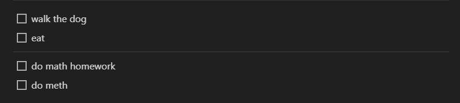

# DTRN
Updates or refreshes TODOs in a notion block.

## WHAT YOU NEED DO
- in the /files directory:
  - notionAPIkey.txt (put in your notionAPI key)
  - blockId.txt (put in your blockIds)
- put the refresher.bat file in the Window Task Scheduler

## TODO STRUCTURE
The app will get all the todo objects in the provided block. Todo blocks above the "divider" block
in the main block will be unchecked if checked. Any Todo blocks below the "divider" block
will be deleted if checked. Any unchecked todos will be left alone

Example:

-
-
-
-
-
-
-
-
-
-
-
-
-
-
-
-
-
-
-
-
-
-
-
-
-
-
-
-
-
-
-
-
-
-
-
-

# TODO
In the future I may add some sort of interface where you can create custom TODOs and stuff, but for now this will do
This is the plan:

# EXPLAINING
controller.bat is called to start controller program: compiles and executes Controller.java
refresher.bat is given to the windows task scheduler and calls the compiles and executes the Refresher.java
---

# DTRN - Daily TODO Refresher for Notion
Notion TODO refresher for Windows. You can create Groups that hold TODOs. The TODOs will be refreshed daily. TODOs come in 2 different types:
- `[R]` - Refresher - A fixed TODO that is unchecked `DEFAULT`
- `[T]` - Temporary - A temporary TODO that is:
  - deleted if checked
  - left alone if not checked (completed)

## CONTROLLER
The controller is an interface that lets you create your TODOs. You can show/add/edit **groups** and a **specific TODO** in a group. If there are any errors while refreshing the TODOs, you will be able do display it in the controller.

### COMMANDS
#### GROUP COMMANDS
- `s`: show all groups
- `a [group_name]`: add a group
- `e [group_name] [new_group_name]`: change group name
- `d [group_name]`: delete group
- `x [group_name]`: activate group
- `dx [group_name]`: de-activate group
  
#### TODO COMMANDS
- `gs [group_name]`: show TODOs in group
- `ga [group_name] [todo_content]`: add TODO to group with default type
  - `ga [group_name] [todo_content] [todo_type]{R,T}`: add TODO with custom type
- `ge [todo_id] [OPTION]`
  - OPTION: `-c=[new_todo_content]`: change todo_content
  - OPTION: `-t=[new_todo_type]{R,T}`: change todo_type
- `gd [todo_id]`: delete a todo

#### OTHER COMMANDS
- `err`: show all errors
  - `err [err_id]`: show error message
- `h`: display all command options