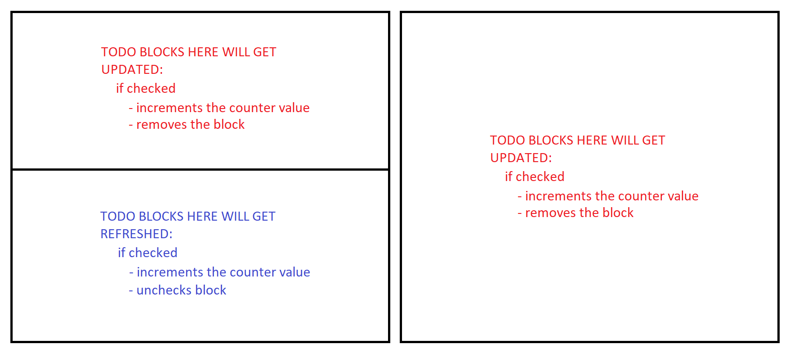
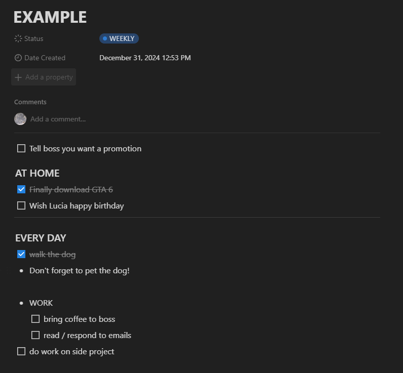
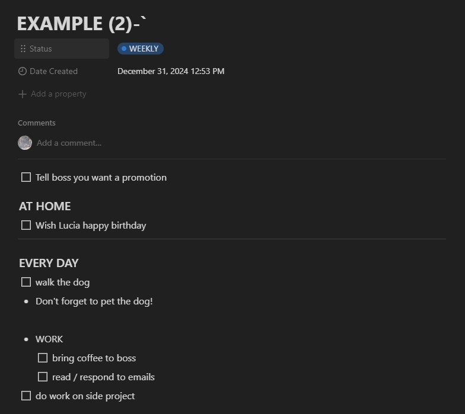

# DTRN

> [!IMPORTANT]
> archived and not in active development

Updates or refreshes TODOs (checkboxes) in Notion blocks.

> [!IMPORTANT]
> 1.0.1 RELEASE COMPATIBILITY:
> - ✅ **[TESTED]** Windows - all commands
> - ✅ **[TESTED]** Linux (systemd) - all commands
> - ⚠️ Linux (other) - `activate` and `deactivate` **do not work**
> - ⚠️ MacOS - `activate` and `deactivate` **do not work**
>
> On systems where `activate` and `deactivate` are not supported, you must either:  
> - manually run `./refresher.sh`, or  
> - set up your own way to run the script automatically (e.g. `cron`, `launchd`, ...).

**HEADERS:**
- [INSTALLATION](#installation)
- [USAGE & TODO STRUCTURE](#usage--todo-structure)
- [VALID EXAMPLE](#valid-example)
- [DEVELOPER NOTES](#developer-notes)

## INSTALLATION
> [!IMPORTANT] 
> To see the tutorial on how to install and set up the refresher program, refer to the [TUTORIAL](readme_files/Tutorial.md).

## USAGE & TODO STRUCTURE
> [!WARNING]
> The Refresher program might not be run if:
> 
> - you do not have a network connection
> - you have battery saver enabled (for laptop users)

The Refresher program only focuses on ___TODO Notion blocks___ and the optional ___divider Notion block___ inside your provided blocks/pages. This means that the Refresher program will not be affected if you add any other Notion blocks inside the block/page being refreshed.

### THE LINE

``The line`` is a divider object in Notion that you can use if you want to separate TODOs based on how the Refresher program will affect them:

- The Refresher program will `update` TODO blocks above the line. This will increment the counter value and remove the TODO block.
- The Refresher program will `refresh` TODO blocks below the line. This will increment the counter value and uncheck the TODO block.

### TITLE

The title is properly created on the first refresh of the block. The title structure is:
- **ORIGINAL TITLE**: 
  - The original title of the block.
  - Changing it **will not** affect the Refresher program.
- **COUNTER**:
  - Stores the number of TODOs refreshed in this block.
  - Changing it **will not** affect the Refresher program.
  - *This is a **long** value in Java => max value is 2^64-1.*
- **MEMORY VALUE**:
  - Stores the last day *(from 1-31)* this block was updated as an ASCII symbol:
    - B=1, C=2, ..., `=31.
  - Changing/removing this **CAN** affect the Refresher program:
    - **IT CAN AFFECT** daily refreshing blocks, potentially causing them to refresh more than once a day.
    - **IT CAN AFFECT** weekly refreshing blocks, potentially causing them to refresh more than once a week. 
    - It also may not, especially if you are using the Refresher program on only one device.

## VALID EXAMPLE

> Here is an example of a block with the correct structure. We set this block to be refreshed daily.
>
> We freely use ``/h3`` and ``/bullet`` Notion blocks inside the block, as these will not affect the Refresher program.
>
> Tasks we want to do every day are placed below **the line** (*``/divider`` Notion block*).
> Tasks that are done only once are placed above **the line**.
>   
> 

> Let's see what happens when the Refresher program refreshes the block:
>
> 
>
> As we can see, the TODO ``Finally download GTA 6`` was updated because it was above the line, and the TODO ``walk the dog`` was refreshed because it was below the line.
>
> The title was also updated. We now see that the ``counter value is 2`` and because the block was refreshed on the 31st of December, the ``memory value is ` ``.

## DEVELOPER NOTES
- in files/DTRNSettings.json, you can change the "run-once" value to 0, if you want ./refresher to ignore the memory value in the title. Any time you run ./refresher it will refresh the Notion block (good for testing).
