# NOTION TUTORIAL
Here I explain how to get blockIds, a Notion API key and how to connect a block with an Notion API key (aka. integration) so that the integration can make changes to that block, through the Notion API.

## HOW TO GET BLOCK IDS FOR ANY BLOCK

1. Right-click or click the "..." and select "Copy link" as shown in the 2 examples below:

    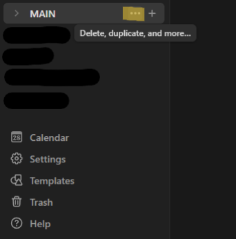
    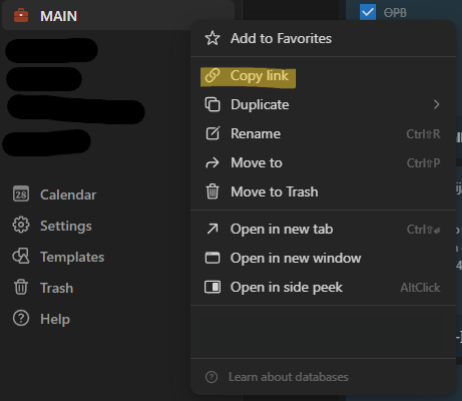

    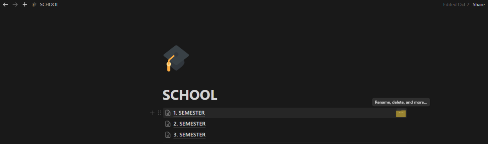
    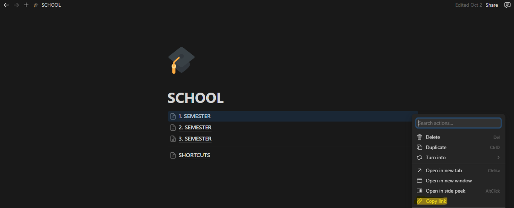

2. Paste the link into Notepad (or in your favorite text editor). The blockId is the number after the block name. Refer to the example below:

    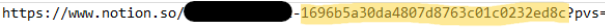

## HOW TO GET A NOTION API KEY

1. Go to https://developers.notion.com/docs/create-a-notion-integration

2. Click on View my integrations in the top right corner

    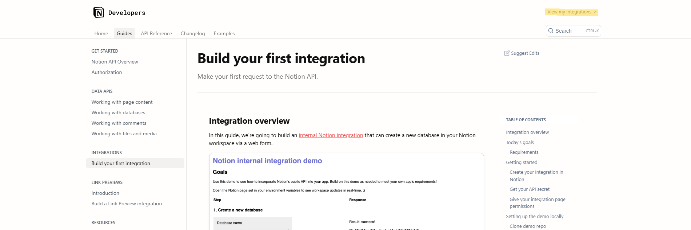

3. Click on "New integration"

    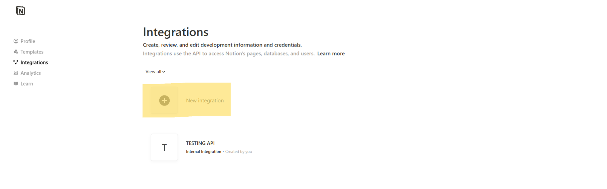

4. Give it a name and an associated workspace (You probably only have one)

    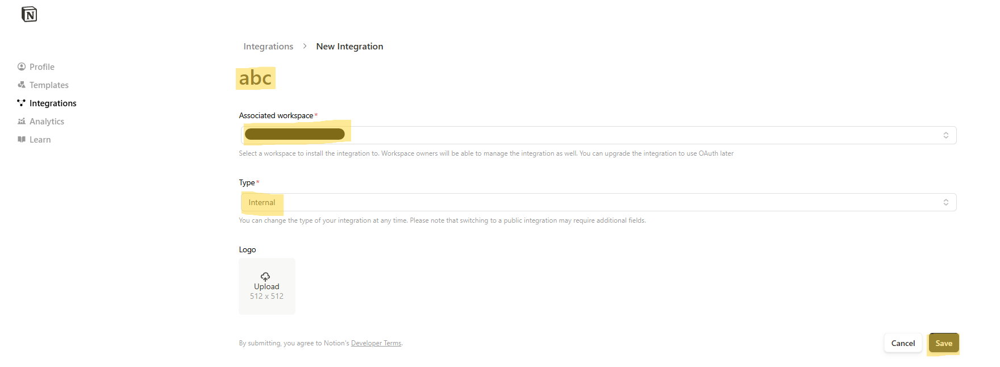

5. You can see the Integration Secret (the Notion API key) if you click "Show"
   
    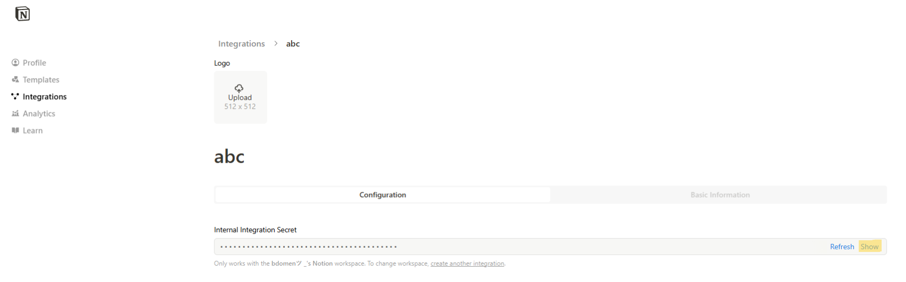

## HOW TO CONNECT A BLOCK WITH AN INTEGRATION

1. Open the Block and click the "..." and click on Connections at the bottom, as shown in the example below:
   
    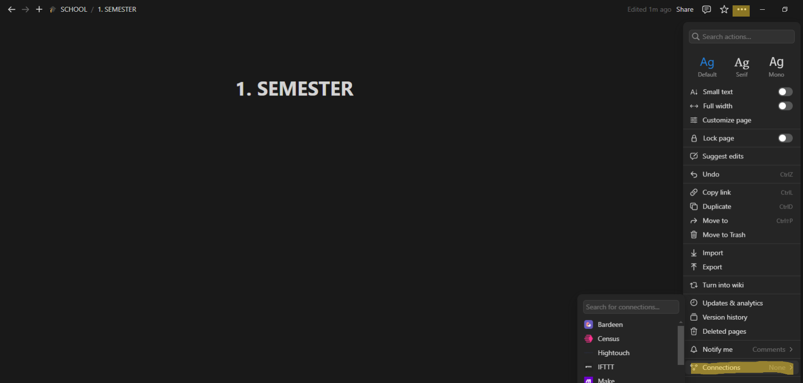

2. Search for your integration and "connect" it with the block

    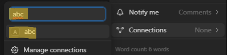