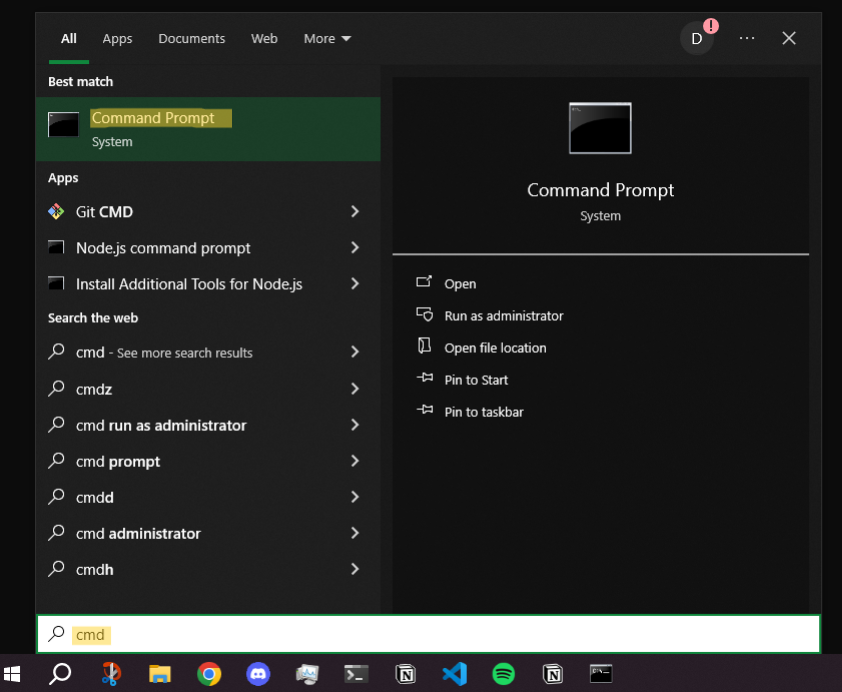
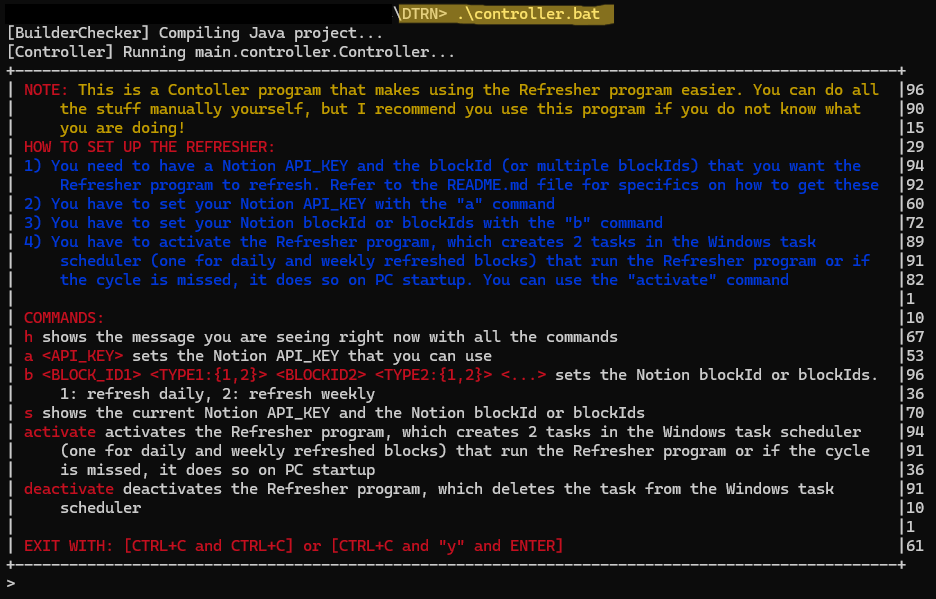
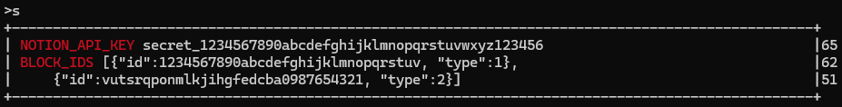

*linux:*
```console
$ chmod u+x controller.sh
```

# SETUP / INSTALLATION TUTORIAL
This is a 6-step tutorial that explains how to install and set up the Refresher program.

**HEADERS:**
- [WHAT YOU NEED (Prerequisites)](#what-you-need-prerequisites)
- [TUTORIAL STEPS FOR REFRESHER PROGRAM](#tutorial-steps-for-refresher-program)
  - [YOU ARE ALL SET!](#you-are-all-set)

## WHAT YOU NEED (Prerequisites)
- **Git**:
  - [Git Installation Tutorial for Windows](https://www.geeksforgeeks.org/install-git-on-windows/) 
  - [Git Installation Tutorial for Other Operating Systems](https://www.geeksforgeeks.org/how-to-install-git/)
- **Java JDK**: 
  - [JDK Installation Tutorial](https://www.geeksforgeeks.org/download-and-install-java-development-kit-jdk-on-windows-mac-and-linux/)
- **Notion**: Refer to the [NOTION TUTORIAL](NotionTutorial.md)
  - Block IDs for the blocks you want refreshed.
  - A Notion API key that can make changes to these blocks.

## TUTORIAL STEPS FOR REFRESHER PROGRAM

1. **Open CMD, clone the git repository, and navigate to the repository directory:**

    
    ```console
    C:\Users\your_name> git clone https://github.com/dbomen/DTRN.git
    ```
    ```console
    C:\Users\your_name> cd DTRN
    ```

2. **Run the Controller program:**

    ```console
    C:\Users\your_name\DTRN> .\controller.bat
    ```
    

3. **Add your Notion API key with the `a` command:**

    ```console
    >a secret_1234567890abcdefghijklmnopqrstuvwxyz123456
    ```

4. **Add your blocks with the `b` command. Specify the type of refreshing for each block:**
    - `1`: Refresh daily.
    - `2`: Refresh weekly.

    ```console
    >b 1234567890abcdefghijklmnopqrstuv 1 vutsrqponmlkjihgfedcba0987654321 2
    ```

    - In the example above:
      - The block with the ID `1234567890abcdefghijklmnopqrstuv` will be refreshed daily (type: `1`).
      - The block with the ID `vutsrqponmlkjihgfedcba0987654321` will be refreshed weekly (type: `2`).
  
5. **OPTIONALLY, check for correctness with the `s` command:**

    ```console
    >s
    ```
    

6. **Activate the Refresher program with the `activate` command:**

    ```console
    >activate
    ```

### YOU ARE ALL SET!

- If you want to deactivate the Refresher program, you can do so in the Controller program using the `deactivate` command or manually in the Task Scheduler application.
- To add or change blocks or the Notion API key, use the `b` and `a` commands in the Controller program. Note that you do not need to `deactivate` and then `activate` the tasks in Task Scheduler again.
